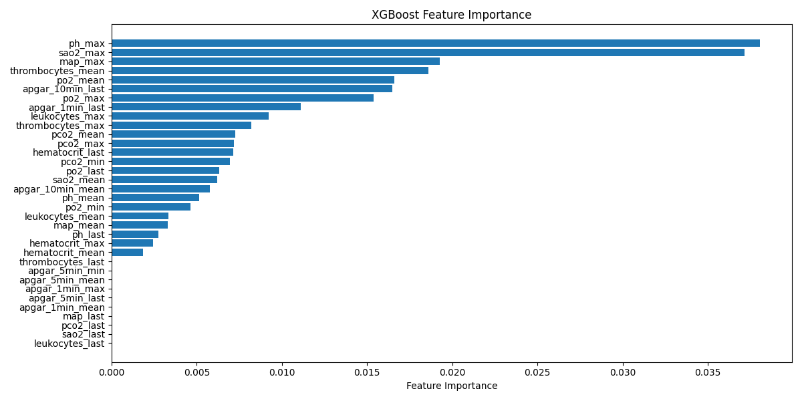

# Brain Hemorrhage Prediction Model: Binary Classifier Results

## Overview

This report summarizes the performance of the ensemble binary classifier developed to predict the presence of brain hemorrhage using clinical and laboratory data. The results are based on the validation set and include key metrics, confusion matrix, feature importance, and visualizations.

---

## Model Parameters

| Parameter         | Value(s)                        |
|-------------------|---------------------------------|
| Model Type        | Ensemble (XGBoost)              |
| n_estimators      | 150, 200, 250, 300, 200         |
| max_depths        | 4, 6, 4, 5, 3                   |
| learning_rates    | 0.1, 0.05, 0.03, 0.02, 0.08     |
| scale_pos_weights | 5, 4, 4.5, 4, 4.5               |
| Threshold         | 0.20                            |

---

## Performance Metrics

| Metric             | Value   |
|--------------------|---------|
| Accuracy           | 0.88    |
| Balanced Accuracy  | 0.89    |
| Precision          | 0.83    |
| Recall (Sensitivity)| 0.92   |
| Specificity        | 0.85    |
| F1 Score           | 0.87    |
| MCC                | 0.77    |
| ROC AUC            | 0.93    |
| PR AUC             | 0.91    |

---

## Confusion Matrix

|                | Predicted No Hemorrhage | Predicted Hemorrhage |
|----------------|------------------------|----------------------|
| **Actual No Hemorrhage** | 29                   | 5                    |
| **Actual Hemorrhage**    | 2                    | 24                   |

- **True Negatives (TN):** 29
- **False Positives (FP):** 5
- **False Negatives (FN):** 2
- **True Positives (TP):** 24

---

## Feature Importance

The most influential features for the model (top 5 by importance):

| Feature            | Importance |
|--------------------|------------|
| ph_max             | 0.038      |
| sao2_max           | 0.037      |
| map_max            | 0.019      |
| thrombocytes_mean  | 0.019      |
| po2_mean           | 0.017      |

---

## Visualizations

### ROC Curve

### Precision-Recall Curve

### Confusion Matrix

### Feature Importance

---

## Interpretation and Clinical Application

### Model Performance

- **High Sensitivity (Recall = 0.92):** The model is highly effective at identifying patients with brain hemorrhage, minimizing the risk of missed diagnoses (false negatives).
- **High Specificity (0.85):** The model also maintains a strong ability to correctly identify patients without hemorrhage, reducing unnecessary interventions.
- **AUC Scores (ROC = 0.93, PR = 0.91):** These indicate excellent discriminative ability, even in the presence of class imbalance.

### Clinical Relevance

- **Early Detection:** The model can serve as a decision support tool for clinicians, flagging high-risk patients for further imaging or intervention.
- **Resource Optimization:** By accurately identifying low-risk patients, the model may help reduce unnecessary imaging, hospital stays, and associated costs.
- **Feature Insights:** Laboratory values such as pH, SaO2, MAP, and thrombocyte counts are among the most predictive, aligning with known clinical risk factors for hemorrhage.

### Limitations & Considerations

- **Validation:** Results are based on a validation set; external validation on independent cohorts is necessary before clinical deployment.
- **Threshold Selection:** The threshold of 0.20 was chosen to optimize sensitivity, but this can be adjusted based on clinical priorities (e.g., minimizing false negatives vs. false positives).
- **Interpretability:** While ensemble models are powerful, their complexity may limit direct interpretability. Feature importance plots can help guide clinical understanding.

---

## Conclusion

The ensemble binary classifier demonstrates strong predictive performance for brain hemorrhage detection, with potential to enhance clinical decision-making and optimize resource allocation. Further validation and integration with clinical workflows are recommended for real-world application.

---

**For further details, see the full set of plots and results in the `model_performance_visuals` directory.**
