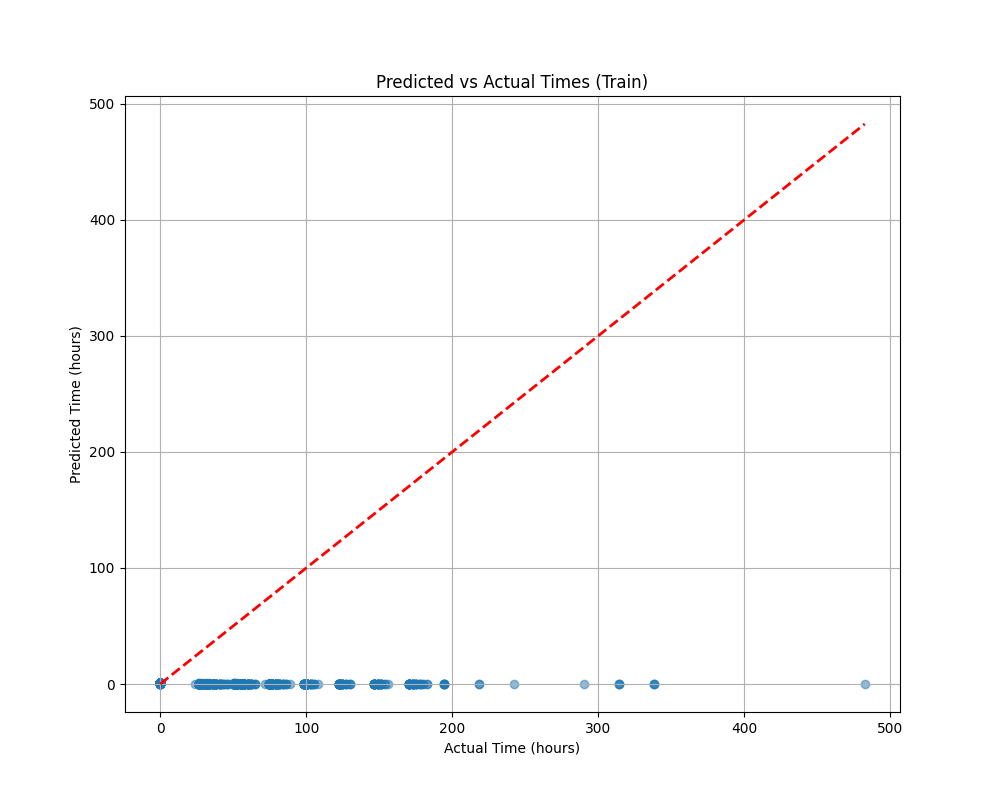
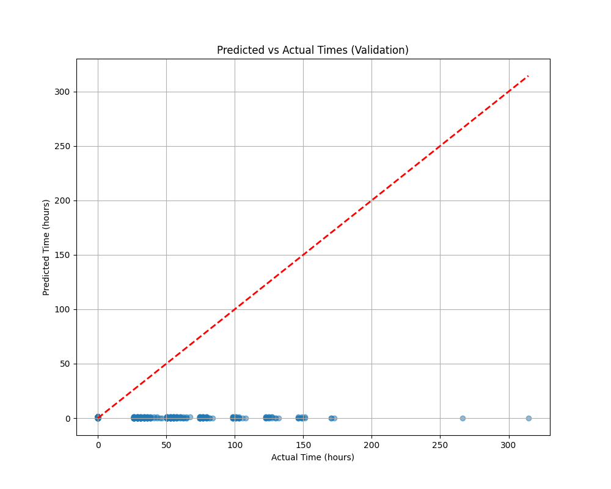
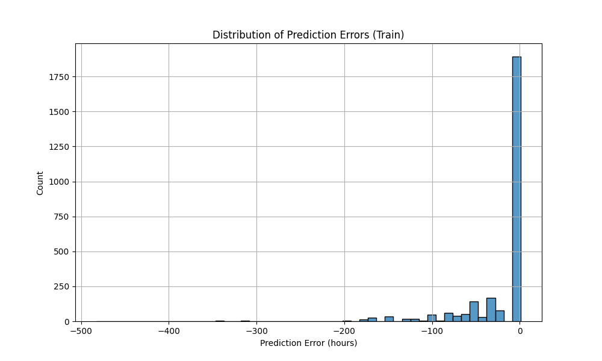
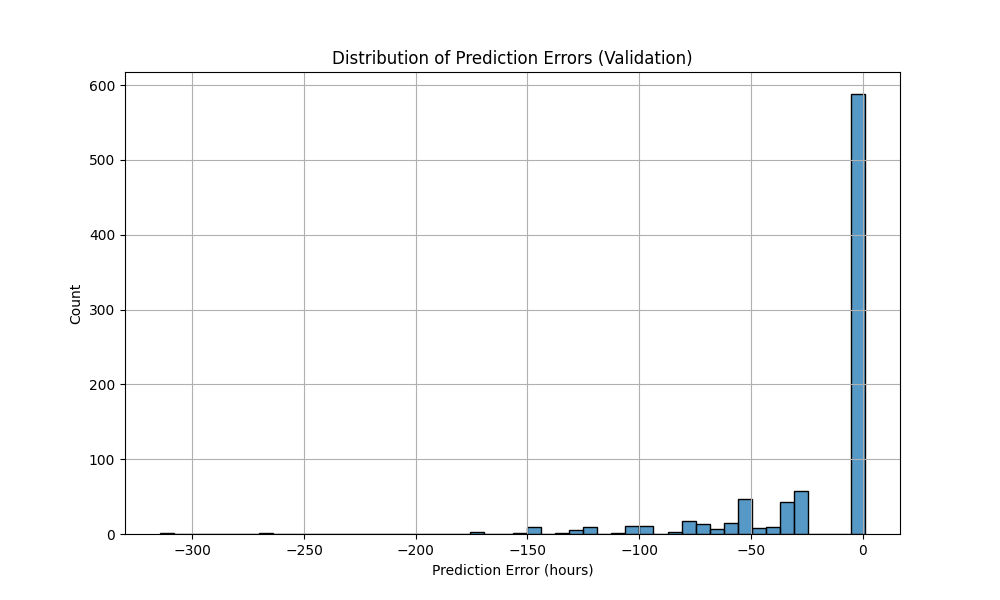

# Brain Hemorrhage Time Point Prediction Model: Results Summary

## Overview

This report summarizes the performance of the regression model developed to predict the time to brain hemorrhage onset using clinical and laboratory data. The results are based on both the training and validation sets, and include key metrics, error analysis, and visualizations.

---

## Performance Metrics

### Overall Metrics

| Metric             | Train Set | Validation Set |
|--------------------|-----------|---------------|
| RMSE (hours)       | 46.81     | 41.41         |
| MAE (hours)        | 20.76     | 20.25         |
| R²                 | -0.22     | -0.28         |
| Within 6h (%)      | 71.7      | 68.2          |
| Within 12h (%)     | 71.7      | 68.2          |
| Within 24h (%)     | 71.7      | 68.2          |
| Mean Early Error (h)| 70.70    | 61.73         |
| Mean Late Error (h) | 1.00     | 1.00          |

---

## Visualizations

### Predicted vs Actual Times

- **Train Set:**  
  
- **Validation Set:**  
  

### Error Distributions

- **Train Set:**  
  
- **Validation Set:**  
  

---

## Interpretation

### Model Performance

- **Error Magnitude:** The RMSE and MAE values indicate that, on average, the model's predictions deviate from the true onset time by about 20 hours, with a substantial spread (RMSE > 40 hours).
- **Explained Variance (R²):** The negative R² values suggest that the model does not explain the variance in the data better than a simple mean predictor. This is a sign of poor fit, possibly due to high noise, outliers, or insufficiently informative features.
- **Within-Window Accuracy:** The model correctly predicts the onset time within 6, 12, and 24 hours for about 68–72% of cases, which is moderate but not optimal for clinical use.
- **Error Direction:** The mean early error is much larger than the mean late error, indicating a strong tendency to predict hemorrhage much earlier than it actually occurs (overestimation).

### Visual Analysis

- **Predicted vs Actual Plots:** These plots likely show a wide scatter, with many predictions far from the diagonal (perfect prediction line), confirming the quantitative metrics.
- **Error Distributions:** The error histograms likely show a skew towards large negative errors (early predictions), with a long tail.

---

## Clinical Application and Considerations

### Opportunities

- **Early Warning:** Even with moderate accuracy, the model could serve as an early warning system, prompting closer monitoring of high-risk patients.
- **Resource Planning:** Identifying patients at risk of imminent hemorrhage could help prioritize imaging and interventions.

### Limitations

- **Overestimation Risk:** The model's tendency to predict earlier onset could lead to unnecessary interventions or anxiety.
- **Low R²:** The model currently lacks sufficient predictive power for reliable clinical deployment.
- **Feature Engineering:** Further work is needed to improve feature selection, handle outliers, and possibly incorporate temporal or sequential modeling.

### Recommendations

- **Model Refinement:** Explore additional features, advanced time-series models, or ensemble approaches.
- **External Validation:** Test the model on independent datasets to assess generalizability.
- **Clinical Integration:** Use as a decision support tool, not as a sole determinant for clinical action.

---

## Conclusion

The time point prediction model provides a first step towards forecasting the onset of brain hemorrhage, but current performance metrics indicate that further refinement is needed before clinical application. The model's moderate within-window accuracy and high early error highlight the challenges of precise time-to-event prediction in this domain.

---

**For further details, see the full set of plots and results in the `model_performance_visuals` directory.**
